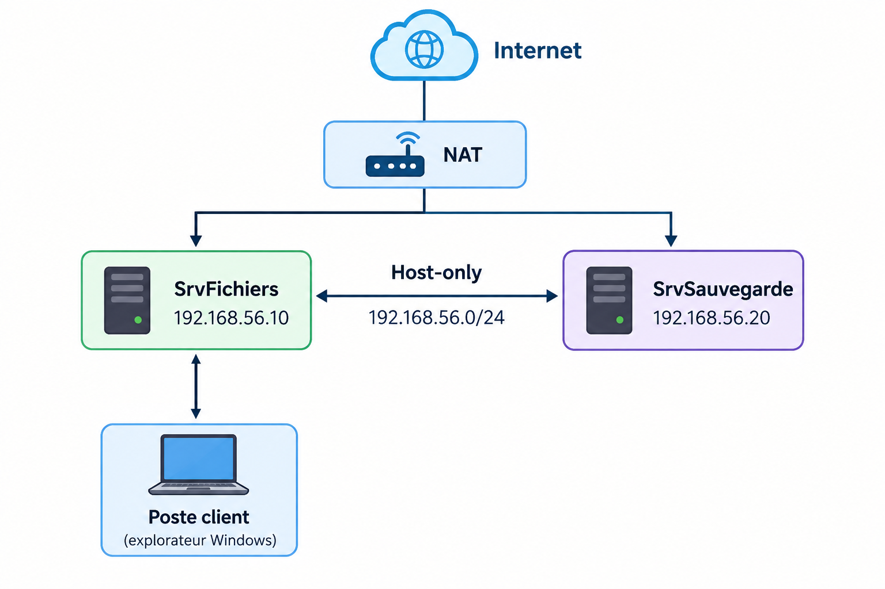

# Serveur de fichiers Samba: Groupes, quotas et sauvegarde automatisée


Projet personnel réalisé dans le cadre de mon BTS SIO (option SISR), visant à construire de A à Z un serveur de fichiers d'entreprise sous Linux : gestion des droits par groupes métiers, quotas disque, sauvegarde automatisée vers un second serveur, et sécurisation par pare-feu.

L'infrastructure est entièrement virtualisée sous VirtualBox (deux VMs Debian 13), pour se rapprocher d'une architecture réelle (serveur de production + serveur de sauvegarde séparé) tout en restant reproductible sur un poste personnel.

## 🎯 Objectifs du projet

- Mettre en place un partage de fichiers Samba avec **cloisonnement des accès par groupe métier** (Direction / Compta / Technique)
- Limiter l'usage disque par service avec des **quotas** (soft/hard)
- Automatiser une **sauvegarde chiffrée** (SSH + rsync) vers un serveur dédié, planifiée via cron
- Restreindre les flux réseau avec un **pare-feu** (UFW), en cohérence avec une exigence de sécurité (le serveur ne doit pas être exposé à Internet)

## 🔍 Qu'est-ce que Samba ?

**Samba** est un service réseau open source qui fait le pont entre le monde Linux et le monde Windows. Il implémente le protocole **SMB/CIFS**, le langage natif utilisé par Windows pour le partage de fichiers et d'imprimantes sur un réseau local.

Concrètement, Samba permet à un serveur Linux de publier des dossiers partagés (« shares ») qu'un poste Windows peut ouvrir directement depuis son explorateur de fichiers (`\\adresse-ip\nom-du-partage`), avec une gestion fine des droits d'accès par utilisateur ou par groupe exactement comme le ferait un serveur de fichiers Windows Server, mais sur une base Linux.

## 🏗️ Architecture

Deux machines virtuelles Debian 13, chacune avec deux interfaces réseau (NAT pour Internet, Host-only pour la communication interne et l'accès depuis le poste client) :

| Machine | Rôle | RAM / vCPU | IP (réseau interne) |
|---|---|---|---|
| **SrvFichiers** | Serveur Samba principal (partages, quotas) | 2048 Mo / 2 vCPU | 192.168.56.10 |
| **SrvSauvegarde** | Réception des sauvegardes (SSH + rsync) | 512 Mo / 1 vCPU | 192.168.56.20 |



## 🛠️ Compétences et technologies mises en œuvre

- **Administration système Linux** (Debian 13) : installation minimale, gestion des services (systemd), désinstallation d'environnement graphique en ligne de commande
- **Réseau** : configuration IP via NetworkManager (`nmcli`), interfaces multiples, ping/diagnostic
- **Samba / SMB-CIFS** : partages réseau, droits par groupe, bit SetGID
- **Gestion des droits Linux** : `chown`, `chmod`, groupes, quotas disque (`quota`, `setquota`, `repquota`)
- **Sauvegarde et automatisation** : SSH par clé (sans mot de passe), `rsync`, `cron`, scripting Bash
- **Sécurité réseau** : pare-feu applicatif (`UFW`), restriction par sous-réseau

## 📁 Structure du dépôt

```
.
├── README.md              → ce fichier
├── PROCEDURE.md            → TP complet, étape par étape, avec captures
└── images/                 → captures d'écran du TP
```

## 📖 Documentation complète

Le déroulé technique intégral (installation, configuration, tests, captures d'écran) est disponible dans **[PROCEDURE.md](./PROCEDURE.md)**.

## 🔎 Points de vigilance rencontrés (retour d'expérience)

Quelques erreurs concrètes rencontrées pendant la réalisation, et corrigées volontairement gardées visibles dans la procédure plutôt que masquées, car elles font partie de l'apprentissage :

- Le compte `backup` est un compte système Debian déjà existant (UID 34) : il a fallu utiliser un nom dédié (`backupuser`) pour éviter le conflit.
- Sur une installation Debian avec bureau, le réseau est géré par **NetworkManager**, pas par `/etc/network/interfaces` la configuration IP se fait donc via `nmcli`.
- L'ordre des étapes compte : impossible d'installer `openssh-server` avant que le réseau (carte NAT) ne soit fonctionnel, puisque l'installation nécessite un accès Internet.

## 👤 Auteur

Projet réalisé par Clara, étudiante BTS SIO SISR (alternance), dans le cadre de la constitution de son portfolio technique.
